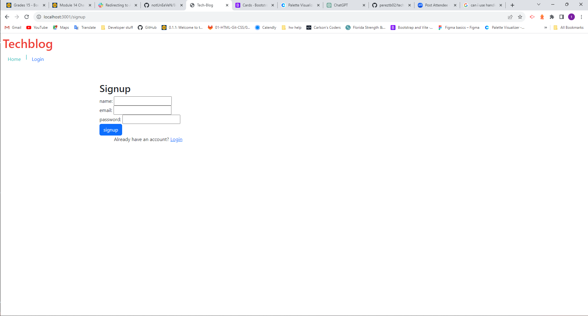

# tech-blog

## 

## Description

AS A developer who writes about tech
I WANT a CMS-style blog site
SO THAT I can publish articles, blog posts, and my thoughts and opinions

## Installation

Requires: dotenv, express, express-handlebars, bcrypt, express-session, connect-session-sequelize, mysql2, and sequelize packages

## Usage

## Citations

## Questions?

If you have questions or suggestions please contact me via email at 

<pereztb03@gmail.com>

Check out my GitHub! 

https://github.com/pereztb02/tech-blog

## Licenses

A short and simple permissive license with conditions only requiring preservation of copyright and license notices. Licensed works, modifications, and larger works may be distributed under different terms and without source code.
